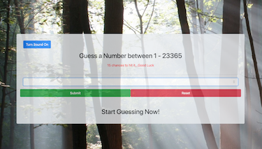

# Guess

## Description
> A single player game that allows the user to guess a number within a randomized range. The number of guesses depends on the size of the range. Background music can be turned on or off based on user preference. A history of previous guesseses is visibile to the user after each attempt.

## Screenshots

## Technologies Used
- React
- JSX
- ES6
- Bootstrap 4
- Webpack

